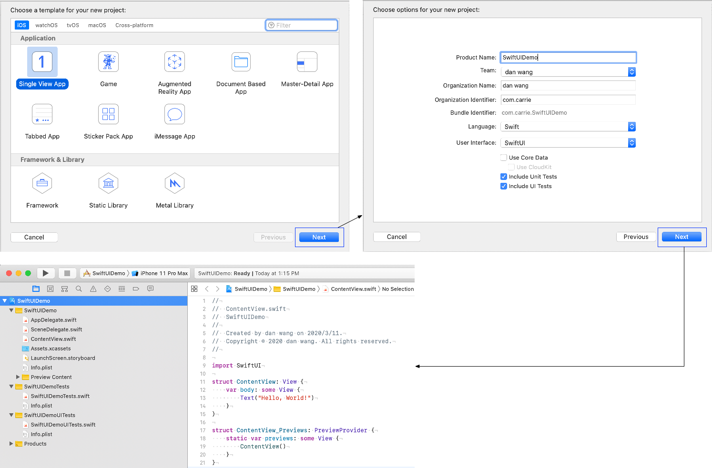
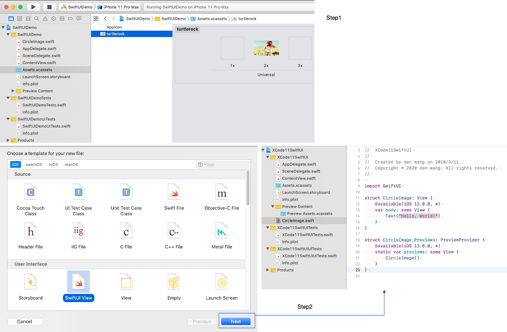
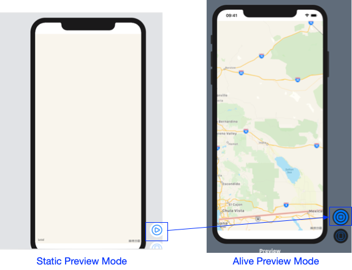

# SwiftUI Tutorial  - Create and Combining Views 

***SwiftUI is a modern way to declare user interfaces for any Apple platform. Create beautiful, dynamic apps faster than ever before.***


#### 1. Create a "Hello World!" Project



###### 认识ContentView & ContentView_Previews

1. ContentView : used to describes the view’s content and layout

2. ContentView_Previews: declares a preview for the content view. 

   Previews has two Mode : Static / Alive

   
#### 2. Customize the Text View display (text,font,padding,frame...)
###### Method 1:  change code


Method 2:  use the inspector (in code) 


Method 3:  use the inspector (in preview canvas) 

​        (As you change the property in inspector, the code in a view's body updates to reflect your changes)


#### 2. SwiftUI->Text & UIKit -> UILabel 

    Text
    
    ``` 
    struct Text: View {		
    	func foregroundColor(_ color: Color?) -> Text
      	func font(_ font: Font?) -> Text
      	...... 											
    }														
     
    protocol View {
        /// The type of view representing the body of this view.
        /// When you create a custom view, Swift infers this type from your
        /// implementation of the required `body` property.
        associatedtype Body : View
        
        /// Declares the content and behavior of this view.
        var body: Self.Body { get }
        
        /// Returns a new view representing `self` with `modifier` applied
        /// to it.
        @inlinable public func modifier<T>(_ modifier: T) -> ModifiedContent<Self, T>
    }
    ```
    UILabel
    ```
    class UILabel:UIView... {
    
    }
    ```
​	We notice that "Text" is a struct, but UILabel is a object.  When call Text.font(...), internal it will call modifier<Text>, modifiers wrap the Text view to change its display or other properties. Each modifier returns the Text view itself, so it’s common to chain multiple modifiers, stacked vertically.

#### 3.  HStack/VStack/List

    1. HStack — Group views together horizontally
```
struct HStack<Content> : View where Content : View {
    /// Creates an instance with the given `spacing` and Y axis `alignment`.
    /// - Parameters:
    ///     - alignment: the guide that will have the same horizontal screen
    ///       coordinate for all children.
    ///     - spacing: the distance between adjacent children, or nil if the
    ///       stack should choose a default distance for each pair of children.
    @inlinable init(alignment: VerticalAlignment = .center, spacing: CGFloat? = nil, @ViewBuilder content: () -> Content)

    /// The type of view representing the body of this view.
    /// When you create a custom view, Swift infers this type from your
    /// implementation of the required `body` property.
    typealias Body = Never
}
```
2. VStack — Group views together vertically

```
struct VStack<Content> : View where Content : View {
    /// Creates an instance with the given `spacing` and Y axis `alignment`.
    /// - Parameters:
    ///     - alignment: the guide that will have the same horizontal screen
    ///       coordinate for all children.
    ///     - spacing: the distance between adjacent children, or nil if the
    ///       stack should choose a default distance for each pair of children.
    @inlinable init(alignment: HorizontalAlignment = .center, spacing: CGFloat? = nil, @ViewBuilder content: () -> Content)

    /// The type of view representing the body of this view.
    /// When you create a custom view, Swift infers this type from your
    /// implementation of the required `body` property.
   	typealias Body = Never
}
```
3. List -  Creates a List that supports multiple selection.
```
struct List<SelectionValue, Content> : View where SelectionValue : Hashable, Content : View {
    /// - Parameter selection: A binding to a set that identifies the selected
    ///   rows.
    /// - See Also: `View.selectionValue` which gives an identifier to the rows.
    /// - Note: On iOS and tvOS, you must explicitly put the `List` into Edit
    ///   Mode for the selection to apply.
    @available(watchOS, unavailable)
    init(selection: Binding<Set<SelectionValue>>?, @ViewBuilder content: () -> Content)

    /// Creates a List that supports optional single selection.
    /// - Parameter selection: A binding to the optionally selected row.
    /// - See Also: `View.selectionValue` which gives an identifier to the rows.
    /// - Note: On iOS and tvOS, you must explicitly put the `List` into Edit
    ///   Mode for the selection to apply.
    @available(watchOS, unavailable)
    init(selection: Binding<SelectionValue?>?, @ViewBuilder content: () -> Content)

    /// Declares the content and behavior of this view.
    var body: some View { get }
    typealias Body = some View
}
```
#### 4. Combine Views Using VStack&HStack

Step1: Command-click the text view’s initializer to show the structured editing popover, and then choose 		embed in VStack.


Step2: Open the library by clicking the plus button (+) at the top-right of the Xcode window, and then drag a `Text` view to the place in your code immediately after the “Turtle Rock” text view.


Step3: Customize the text view newly added


* spacer():  expands to make its containing view use all of the space of its parent view, instead of having its size defined only by its contents.
* padding(): Pads this view using a default edge insets. 

#### 5. Create a Custom Image View

​	Step1: Add Image resource "turtlerock"

​	Step2: Xcode->File->New->File...->SwiftUI view -> Input File name "CircleImage" 



​	Step3: Customize "CircleImage" view 


* clipShape: Sets a clipping shape for this view. 

```
- Parameters:
  	///   - shape: The clipping shape to use for this view. The `shape` fills
    ///     the view's frame, while maintaining its aspect ratio.
    ///   - style: The fill style to use when rasterizing `shape`.
    /// - Returns: A view that clips this view to `shape`, using `style` to
    ///   define the shape's rasterization.
func clipShape<S>(_ shape: S, style: FillStyle = FillStyle()) -> some View where S : Shape
```

- Subclass inherited from Shape (S where S : Shape)

  a) Rectangle: A rectangular shape aligned inside the frame of the view containing it. （长方形）

  b) Circle: A circle centered on the frame of the view containing it. （圆形）

  c) RoundedRectangle: A rectangular shape with rounded corners, aligned inside the frame of the view containing it. （可指定cornerradius的长方形）

  d) Ellipse: An ellipse aligned inside the frame of the view containing it. （椭圆）

  e) capsule: A capsule shape aligned inside the frame of the view containing it. （胶囊）

```
protocal Shape	//A 2D shape that you can use when drawing a view.
```
- overlay 
```
///- Parameters:
///   - overlay: The view to layer in front of this view.
///   - alignment: The alignment for `overlay` in relation to this view.
/// - Returns: A view that layers `overlay` in front of this view.
func overlay<Overlay>(_ overlay: Overlay, alignment: Alignment = .center) -> some View where Overlay : View
```
- shadow: Adds a shadow to this view. 
```
/// - Parameters:
///   - color: The shadow's color.
///   - radius: The shadow's size.
///   - x: A horizontal offset you use to position the shadow relative to
///     this view.
///   - y: A vertical offset you use to position the shadow relative to
///     this view.
/// - Returns: A view that adds a shadow to this view.
func shadow(color: Color = Color(.sRGBLinear, white: 0, opacity: 0.33), radius: CGFloat, x: CGFloat = 0, y: CGFloat = 0) -> some View
```
- stroke: Traces the outline of this shape with a color or gradient. 
```
/// - Parameters:
///   - content: The color or gradient with which to stroke this shape.
///   - lineWidth: The width of the stroke that outlines this shape.
/// - Returns: A stroked shape.
func stroke<S>(_ content: S, lineWidth: CGFloat = 1) -> some View where S : ShapeStyle
```

#### 6. Use "MKMapView" from UIKit and SwiftUI Views Together

Step 1: Xcode -> File -> New -> File... -> SwiftUI view -> Input File name "MapView" -> click "Create"


Step 2: Customize "MapView" view  


```
protocol UIViewRepresentable : View where Self.Body == Never {
    /// The type of `UIView` to be presented.
    associatedtype UIViewType : UIView

    /// Creates a `UIView` instance to be presented.
    func makeUIView(context: Self.Context) -> Self.UIViewType

    /// Updates the presented `UIView` (and coordinator) to the latest
    /// configuration.
    func updateUIView(_ uiView: Self.UIViewType, context: Self.Context)

    /// Cleans up the presented `UIView` (and coordinator) in
    /// anticipation of their removal.
    static func dismantleUIView(_ uiView: Self.UIViewType, coordinator: Self.Coordinator)

    /// A type to coordinate with the `UIView`.
    associatedtype Coordinator = Void

    /// Creates a `Coordinator` instance to coordinate with the
    /// `UIView`.
    /// `Coordinator` can be accessed via `Context`.
    func makeCoordinator() -> Self.Coordinator

    typealias Context = UIViewRepresentableContext<Self>
}
```
Step 3: Switch Preview Mode from static to alive (When previews are in static mode, they only fully render SwiftUI views. Because `MKMapView` is a `UIView` subclass, you’ll need to switch to a live preview to see the map.)



#### 7. Use "UItextView" from UIKit and SwiftUI Views Together


​	Download and refer to the Demo!!!


Reference: https://developer.apple.com/tutorials/swiftui/creating-and-combining-views

Demo: https://github.com/Carrie925/SwiftUIDemo.git

Author: Carrie D Wang